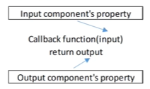
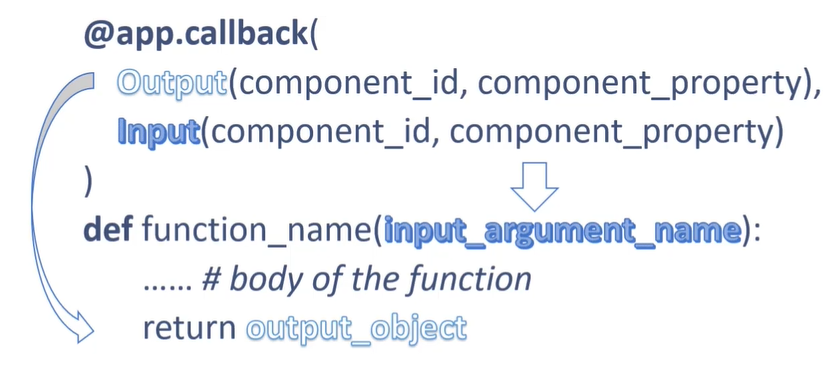

# Callbacks

## Introduction

Callback functions are Python functions and can thus be defined as such. The main difference is that they are **decorated** functions. This funtions will be automatically called by Python when an input's component property changes. Their goal is to update an output component.



To use callback functions we need to import the `Input` and `Output` objects from the `dash.dependencies` module. The general syntax of a callback function is as follows:

``` python
# Function decorator (Outputs first)
@app.callback(
  Output(component_id, component_property),
  Input(component_id, component_property)
)
# Function
def function_name(input_argument_name):
  # Function body
  return output_object
```

Before using a component in a callback function we need to declare it in the app layout. We need to give it a unique name (its ID).



## Multiple IOs

Callbacks can have more than one input and output objects

``` python
# Function decorator (Outputs first)
@app.callback(
  Output(output_id1, output_property1),
  Output(output_id2, output_property2),
  Output(output_id3, output_property3),
  Input(input_id1, input_property1)
  Input(input_id2, input_property2)
  Input(input_id3, input_property3)
)
# Function
def function_name(input_id1, input_id2, input_id3):
  # Function body
  return output1, output2, output3
```

Just keep in mind that the order in which you specify the inputs in the function needs to the be the same order as they are defined in the decorator. Similarly, the order in which declare the outputs in the decorator needs to be the same as the order in which you pass them to the return statement. There doesn't need to be the same number of inputs and outputs.

## Chaining IOs
